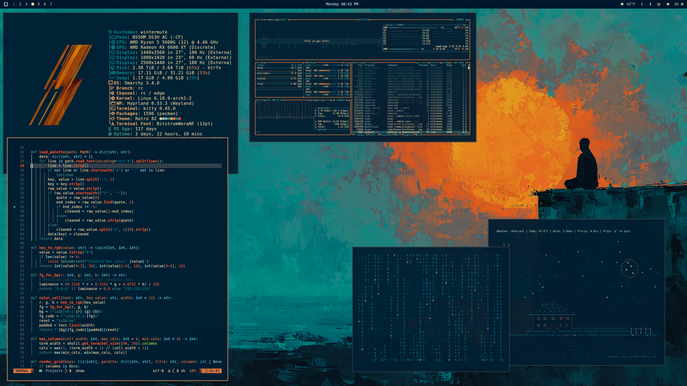
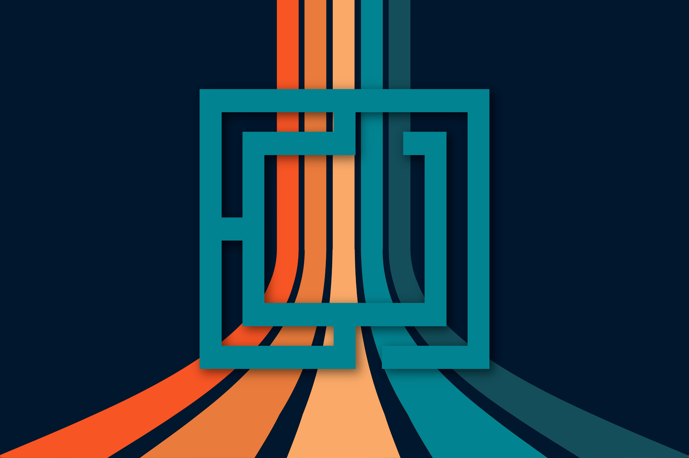

# Omarchy Retro 82 Theme

Retro-futurist Omarchy theme with a deep navy base, warm amber highlights, and cyan/teal support tones across desktop UI, shell tools, editors, and terminal apps.



## Install

Install from GitHub:

```bash
omarchy-theme-install https://github.com/OldJobobo/omarchy-retro-82-theme
```


## What is included

- Hyprland theme overrides: `hyprland.conf`
- Lock screen styling: `hyprlock.conf`
- Bars, menus, notifications, and OSD: `waybar.css`, `wofi.css`, `walker.css`, `mako.ini`, `swayosd.css`
- Terminal themes: `alacritty.toml`, `kitty.conf`, `ghostty.conf`, `warp.yaml`
- GTK and app UI styling: `gtk.css`, `vencord.theme.css`, `obsidian.css`
- Browser and icon pointers: `chromium.theme`, `icons.theme`
- Editor/tool integrations: `neovim.lua`, `btop.theme`, `vscode.json`, `aether.zed.json`, `aether.override.css`


## Wallpapers

<table cellpadding="8">
  <tr>
    <td align="center" valign="top"><br><sub>01-omarchy.jpg</sub></td>
    <td align="center" valign="top"><br><sub>02-retro-sf.png</sub></td>
    <td align="center" valign="top"><br><sub>03-abstract-lines.png</sub></td>
  </tr>
  <tr>
    <td align="center" valign="top"><br><sub>04-zen-boat.png</sub></td>
    <td align="center" valign="top"><br><sub>05-gateway.jpg</sub></td>
    <td align="center" valign="top"><br><sub>06-pirate-bay.jpg</sub></td>
  </tr>
</table>


## VS Code extension wrapper

This repo also contains a local VS Code extension wrapper under `vscode-extension/`.
It is not published on the VS Code Marketplace.

Install directly from the bundled VSIX:

```bash
code --install-extension ./vscode-extension/retro-82-theme-0.0.1.vsix
```

Optional (maintainers): rebuild the VSIX package:

```bash
cd vscode-extension
vsce package
```
