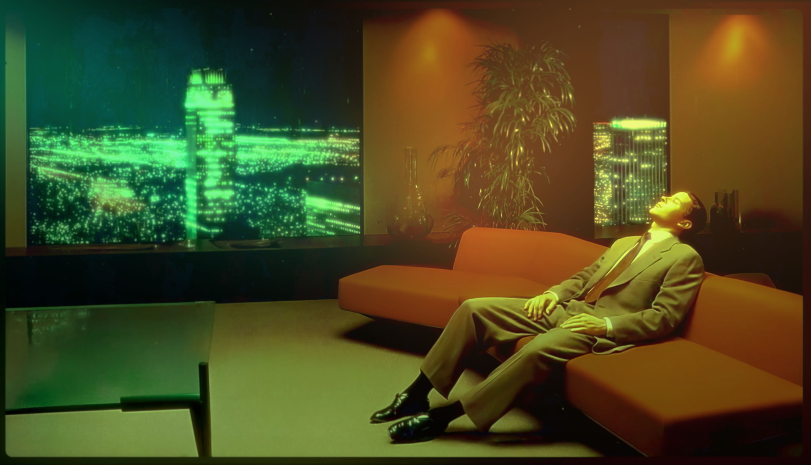

# Omarchy Retro 82 Theme

Retro-futurist Omarchy theme with a deep navy base, warm amber highlights, and cyan/teal support tones across desktop UI, shell tools, editors, and terminal apps.

Attribution: Palette inspiration and feedback by [@niraletter](https://github.com/niraletter).


## Install

Install from GitHub:

```bash
omarchy-theme-install https://github.com/OldJobobo/omarchy-retro-82-theme
```


## What is included

- Custom Vencord theme: `vencord.theme.css` (full Retro '82 Discord skin)
- Full VS Code theme support: `vscode.json` wired to standalone extension `oldjobobo.retro-82-theme`
- Core desktop styling: `hyprland.conf`, `hyprlock.conf`, `waybar.css`, `wofi.css`, `walker.css`, `mako.ini`, `swayosd.css`
- Terminal palette set: `alacritty.toml`, `kitty.conf`, `ghostty.conf`, `warp.yaml`
- App/editor integrations: `gtk.css`, `obsidian.css`, `neovim.lua`, `btop.theme`, `aether.zed.json`, `aether.override.css`


## Wallpapers

<table cellpadding="8">
  <tr>
    <td align="center" valign="top"><br><sub>01-omarchy.jpg</sub></td>
    <td align="center" valign="top"><br><sub>02-retro-sf.png</sub></td>
    <td align="center" valign="top"><br><sub>03-abstract-lines.png</sub></td>
  </tr>
  <tr>
    <td align="center" valign="top"><br><sub>04-zen-boat.png</sub></td>
    <td align="center" valign="top"><br><sub>05-gateway.jpg</sub></td>
    <td align="center" valign="top"><br><sub>06-pirate-bay.jpg</sub></td>
  </tr>
  <tr>
    <td align="center" valign="top"><br><sub>07-livingroom-1982.jpg</sub></td>
  </tr>
</table>

## Donate

- If you enjoy what I do, consider supporting me on Ko-fi: <https://ko-fi.com/oldjobobo>
