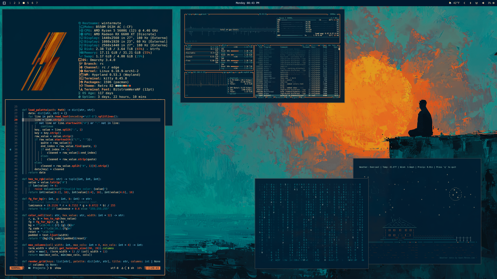
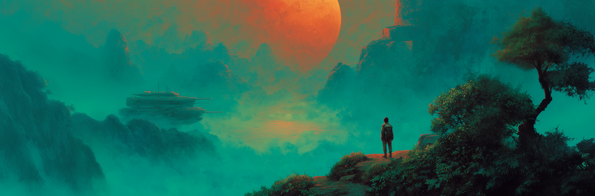
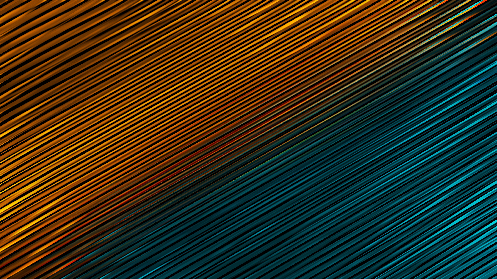
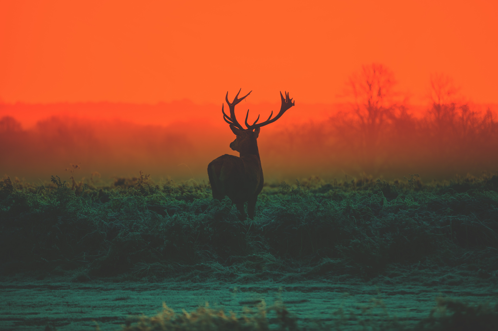
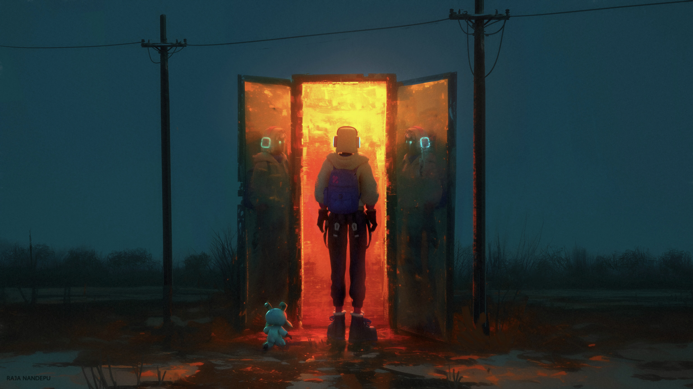
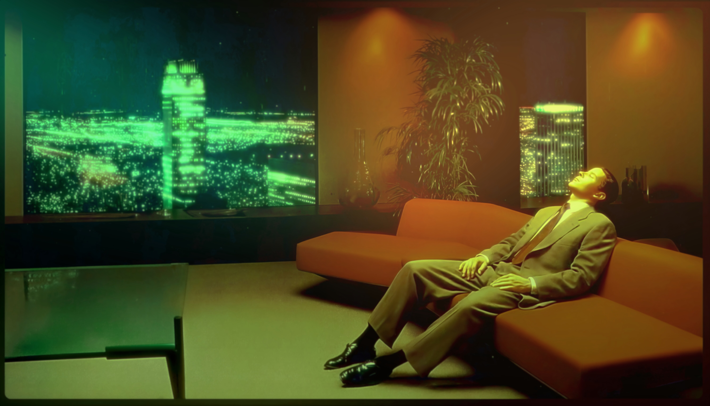
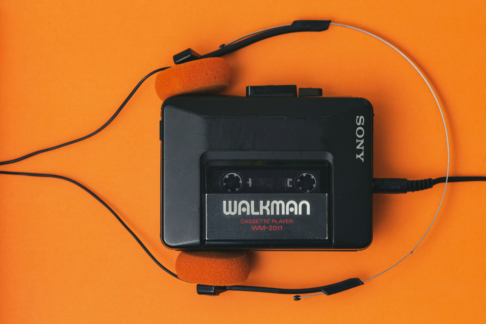

# Omarchy Retro 82 Theme

Retro-futurist Omarchy theme built from deep navy surfaces, warm amber focus states, and teal support colors. Retro 82 keeps the desktop dark and compact while carrying the same palette through the Quattro shell, terminals, editors, and application chrome.

## Preview



## Install

Use the Omarchy theme installer:

```bash
omarchy-theme-install https://github.com/OldJobobo/omarchy-retro-82-theme
```

## What's Included

- Native Omarchy 4/Quattro palette, Quickshell surfaces, and Hyprland Lua styling through `colors.toml`, `shell.toml`, and `hyprland.lua`
- Omarchy 3.8 compatibility styling for Hyprland, Hyprlock, Waybar, Walker, Mako, and SwayOSD
- A full Retro 82 Vencord skin in `vencord.theme.css`
- VS Code integration for the standalone `oldjobobo.retro-82-theme` extension
- Retro 82 terminal mappings for Alacritty, Foot, Ghostty, Kitty, and Warp
- Editor and tool integrations for Neovim, Helix, Zed/Aether, Pi, Obsidian, btop, GTK, and Chromium

## Wallpapers

The theme ships 27 still wallpapers plus two optional animated MP4 wallpapers for setups with animated-wallpaper support.

<table>
  <tr>
    <td></td>
    <td></td>
    <td></td>
  </tr>
  <tr>
    <td></td>
    <td></td>
    <td></td>
  </tr>
  <tr>
    <td></td>
    <td></td>
    <td></td>
  </tr>
</table>

## Attribution

Palette inspiration and feedback by [@niraletter](https://github.com/niraletter).

Added wallpaper sources:

- `16-ember-stallion.jpg` — photo by [Alexander Kovalev](https://unsplash.com/@alkomosh) on [Unsplash](https://unsplash.com/photos/_5l07A3TiNw)
- `17-neon-harbor.jpg` — photo by [Alexey Turenkov](https://unsplash.com/@2renkov) on [Unsplash](https://unsplash.com/photos/zyEY2H0BTDo)
- `18-last-signal.jpg` — creator and original source were not embedded in the downloaded file; attribution remains unidentified
- `19-orange-orbit.jpg` — shared by [Javalonte](https://wallhaven.cc/user/Javalonte) on [Wallhaven](https://wallhaven.cc/w/4lv7ky); no original source was listed
- `20-summer-passage.jpg` — photo by [Ionut Roman](https://unsplash.com/@rroman429) on [Unsplash](https://unsplash.com/photos/6rOmFM0HllA)
- `21-berry-static.jpg` — photo by [Moon Moons](https://unsplash.com/@moonmoons_days) on [Unsplash](https://unsplash.com/photos/oQANRt7fpps)
- `22-palm-echoes.jpg` — sourced from [WallpapersDen](https://wallpapersden.com/palm-trees-branches-wallpaper/2560x1440/); no creator was listed
- `23-beetle-parade.jpg` — photo by [Claudio Ruiz](https://www.pexels.com/@clausthor/) on [Pexels](https://www.pexels.com/photo/parked-classic-volkswagen-beetle-cars-5085636/)
- `24-mustang-muse.jpg` — photo by [Dante Muñoz](https://www.pexels.com/@dantemunozphoto/) on [Pexels](https://www.pexels.com/photo/a-woman-in-a-dress-and-high-heels-standing-next-to-a-classic-car-16259519/)
- `25-amber-veil.jpg` — photo by [Engin Akyurt](https://www.pexels.com/@enginakyurt/) on [Pexels](https://www.pexels.com/photo/orange-and-yellow-color-illustration-7415261/)
- `26-typed-memory.jpg` — photo by [Min An](https://www.pexels.com/@minan1398/) on [Pexels](https://www.pexels.com/photo/close-up-photo-of-vintage-typewriter-1425146/)
- `27-chromatic-drift.mp4` — [“Abstract motion background with dynamic diagonal lines in blue orange”](https://www.vecteezy.com/video/75493078-abstract-motion-background-with-dynamic-diagonal-lines-in-blue-orange) from Vecteezy; contributor was not exposed by the source page
- `28-electric-frame.mp4` — video by [Chot Studio](https://www.vecteezy.com/members/suntorn01) on [Vecteezy](https://www.vecteezy.com/video/5634115)
- `29-velvet-dunes.jpg` — artwork by [Xebelion](https://linktr.ee/xebelion), shared on [Wallhaven](https://wallhaven.cc/w/m3mggm)

## Support

If you enjoy my theme work, you can support it on [Ko-fi](https://ko-fi.com/oldjobobo).
